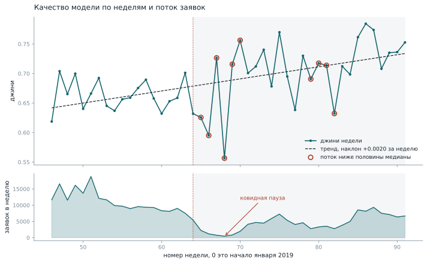

# Кредитный скоринг: устойчивость модели во времени

Решение соревнования [Home Credit - Credit Risk Model Stability](https://www.kaggle.com/competitions/home-credit-credit-risk-model-stability):
предсказать дефолт по заявке так, чтобы качество не падало со временем.

Цель проекта не место в таблице лидеров. Цель это пайплайн, с которым можно
спорить: честная проверка, метрики, понятные кредитному аналитику, и явный
разбор того, где модель ломается.

## Задача
Кредитор видит заявку и должен решить, вернёт ли заёмщик деньги. Дефолтов
около трёх процентов, поэтому модель, которая всем говорит «вернёт», права в 97
процентах случаев и при этом совершенно бесполезна. Accuracy тут не инструмент.

Отдельная сложность в том, что модель стареет. Меняется состав заявителей,
экономика, продуктовая линейка. Модель, обученная на прошлом годе, через
полгода работает хуже, и соревнование измеряет именно это.

## Метрика
Основная метрика это устойчивость джини. Джини считается отдельно внутри каждой
недели, через полученные значения проводится прямая, и дальше:

```
устойчивость = среднее(джини) + 88.0 * min(0, наклон) - 0.5 * std(остатков)
```

Множитель 88 при отрицательном наклоне означает, что падение качества во
времени дороже, чем само качество. Модель, которая блестит сегодня и
посредственна через три месяца, проигрывает ровной и более слабой.

Рядом считаются метрики, которые объясняют, почему оценка сдвинулась:

|            Метрика            |                      На какой вопрос отвечает                     |
| ----------------------------- | ----------------------------------------------------------------- |
|            ROC AUC            | Ставит ли модель случайного дефолтника выше случайного платящего? |
|             PR AUC            |    Сколько точности выживает при доле дефолтов в три процента?    |
|             Джини             |       То же качество ранжирования в привычных банку единицах      |
|               KS              |         Где скор сильнее всего разделяет хороших и плохих         |
| Доля дефолтов в худшем дециле |       Если отказать десяти процентам худших, чего мы избежим      |

## Главные выводы

**Что построено.** Модель дефолта по заявке на 498 признаках, собранных из
пятнадцати связанных таблиц. AUC 0.853 против 0.816 у модели на одной анкете.
Среди десяти процентов худших по скору дефолтят 16.9 процента при 3.3 в среднем
по портфелю.

**Откуда взялось качество.** Почти целиком из кредитного бюро: одна таблица дала
+0.029 AUC из общих +0.036. Свёртки второго уровня вложенности, на которые ушло
больше всего вычислений, не дали ничего.

**Где модель слепа.** У четырёх процентов заявителей нет записей в кредитном
бюро. Джини на них падает с 0.699 до 0.477, при том что дефолтят они не реже
остальных. Такие заявки нельзя пропускать через общий скоринг.

**Где модель врёт.** В среднем вероятности откалиброваны идеально, но самым
надёжным заявителям риск завышен в 1.85 раза. Если ставка считается от
предсказанной вероятности, лучшие клиенты переплачивают и уходят.

**Чему равен шум.** Повторы одной конфигурации дают размах 0.004 по AUC и 0.033
по метрике соревнования. Три вывода проекта под этот фильтр не прошли и помечены
как неразличимые.

## Данные
В соревновании около двадцати связанных таблиц и полтора миллиона заявок за
период с января 2019 по октябрь 2020.

|     Таблица     | Глубина |    Строк    | Колонок |
| --------------- | ------- | ----------- | ------- |
|       base      | опорная |  1 526 659  |    5    |
|      static     |    0    |  1 526 659  |   168   |
|    static_cb    |    0    |  1 500 476  |    53   |
|     applprev    |    1    |  6 525 979  |    41   |
| credit_bureau_a |    1    |  15 940 537 |    79   |
|      person     |    1    |  2 973 991  |    37   |
| credit_bureau_a |    2    | 188 298 452 |    19   |

Глубина ноль означает одну строку на заявку, такие таблицы приклеиваются
напрямую. Глубина один и два дают много строк на заявку и требуют агрегации.

Последняя буква в имени колонки кодирует тип: `A` это сумма, `D` это дата, `P`
это дни просрочки, `M` это замаскированная категория, `L` это всё остальное.
Описания 465 колонок лежат в `feature_definitions.csv` рядом с данными.

## Как получить данные
```bash
pip install kaggle
kaggle competitions download -c home-credit-credit-risk-model-stability -p data/raw
```

Распаковать нужно только папку `parquet_files`. Те же данные в CSV занимают 25
гигабайт против 1.3 в parquet.

## Как запустить
Установка:

```bash
pip install -r requirements.txt && pip install -e .
```

Финальная модель проекта:

```bash
python -m credit_risk.cli --sample 800000 --aggregates applprev credit_bureau_a credit_bureau_b person deposit debitcard other tax_a tax_b tax_c --depth2 cb_a_pmts cb_b_pmts applprev2 person2 --tag final
```

Быстрый прогон на одной анкете, без свёрток:

```bash
python -m credit_risk.cli --sample 300000 --compare-random
```

Без `--sample` считается на всех полутора миллионах заявок, но на машине с 16 ГБ
памяти это уже рискованно. Результаты печатаются и складываются в
`reports/<tag>.json`.

Посмотреть на любую таблицу, не открывая её в редакторе:

```bash
python scripts/peek.py train_static_0_0 --columns 15 --describe
```

Каждый эксперимент из разделов ниже воспроизводится своим скриптом, команда
указана в конце соответствующего раздела.

## Политика в отношении данных
В репозитории только код. Данные соревнования не выкладываются сюда никогда, ни
целиком, ни выборкой. Home Credit даёт к ним доступ для участия в соревновании,
и правила запрещают передавать их тем, кто эти правила не принимал. Скачай их
сам под своим аккаунтом.

В `reports/` попадают только агрегаты: метрики, результаты по фолдам, вклад
признаков. Ни одной исходной строки с машины не уходит.

## Проверка модели
Разбиение по времени с расширяющимся окном. Первый фолд учится на первой
половине недель и проверяется на следующем куске, дальше обучающая часть
растёт, а проверочная едет вперёд. Ни одна строка из будущего не попадает в
обучение.

Для сравнения в коде оставлена и случайная стратифицированная нарезка. Она
перемешивает недели, то есть разрешает модели подглядеть в будущее, и потому
систематически завышает качество. Разница между двумя числами и есть цена
неправильной валидации, флаг `--compare-random` её показывает.

## Сколько шума в измерениях
Весь проект сравнивает конфигурации, и разницы там бывают в тысячные доли. Чтобы
такие сравнения что-то значили, надо знать разброс самого измерения. Одна и та же
конфигурация прогнана по четыре раза в двух режимах: меняется только зерно модели
и меняется ещё и выборка заявок.

|             Что меряем             |   Среднее   |   Разброс   |   Размах   |
| ---------------------------------- | ----------- | ----------- | ---------- |
|      AUC, только зерно модели      |   0.84627   |   0.00045   |   0.0011   |
| Устойчивость, только зерно модели  |   0.66217   |   0.00072   |   0.0017   |
|       AUC, выборка и модель        |   0.84582   |   0.00168   |   0.0041   |
| **Устойчивость, выборка и модель** | **0.64987** | **0.01523** | **0.0331** |

**Метрика соревнования оказалась крайне шумной.** На одной и той же выборке она
воспроизводится с точностью до 0.002, но стоит сменить выборку заявок, и размах
достигает 0.033. Это больше, чем почти любая разница, которую мы сегодня
измерили.

Причина в её устройстве. Устойчивость считается из 46 недельных значений джини,
каждое на выборке в несколько тысяч заявок, и наклон прямой через них умножается
на 88. Смена выборки перетасовывает недельный состав, наклон гуляет, и множитель
88 превращает это гуляние в разброс итогового числа.

AUC ведёт себя приличнее: размах 0.004.

### Что из выводов проекта устояло

|                Утверждение                |   Разница   |           Вердикт            |
| ----------------------------------------- | ----------- | ---------------------------- |
| Свёртки поднимают качество, 0.816 → 0.852 |  +0.036 AUC |  Настоящее, девять размахов  |
|    Кредитное бюро даёт основной прирост   |  +0.029 AUC |          Настоящее           |
|      Отрезать кризисный период вредно     |  −0.008 AUC |    Настоящее, два размаха    |
|  Топ-250 признаков не хуже полного набора |  −0.002 AUC | Подтверждено: разница в шуме |
|      Урезание до 75 признаков вредит      |  −0.007 AUC |          Настоящее           |
|        Прошлые заявки дают прирост        |  +0.004 AUC |  На границе, не утверждаем   |
|      Свёртки глубины два дают прирост     | +0.0006 AUC |             Шум              |
|      Ансамбль лучше одиночной модели      | +0.0015 AUC |             Шум              |
|      Ансамбль поднимает устойчивость      |    +0.006   |             Шум              |

Выводы разбора ошибок под этот фильтр не попадают: разрыв в джини между
заявителями с историей и без неё составляет 0.215, а завышение риска в первом
дециле достигает 1.85 раза. Это на порядок больше любого мыслимого шума.

**Практический вывод для дальнейшей работы.** Сравнивать конфигурации по метрике
устойчивости бессмысленно без нескольких повторов. Для одиночных прогонов
ориентироваться надо на AUC, а устойчивость смотреть только как итоговую
характеристику.

### Оговорка

Измерен разброс между независимыми прогонами. Наши сравнения конфигураций делались
на одном и том же зерне, то есть парно, а в парных сравнениях часть шума
сокращается. Значит порог выше реального, и часть забракованных выводов могла быть
настоящей. Установить это можно только повторами каждой конфигурации, а не одной.

Воспроизвести:

```bash
python scripts/repeatability.py --sample 600000 --repeats 4
```

## Результаты бейзлайна
Выборка 300 тысяч заявок, только таблицы нулевой глубины, 185 признаков после
отбора. Числа сравнимы только между собой, не с таблицей лидеров: метрика тут
считается на проверочных неделях внутри обучающего периода, а на Kaggle тест
лежит целиком позже всех обучающих данных.

|        Проверка        |  AUC  | Устойчивость |
| ---------------------- | ----- | ------------ |
|  Время, растущее окно  | 0.808 |    0.575     |
| Время, скользящее окно | 0.807 |    0.577     |
|   Случайная нарезка    | 0.805 |    0.570     |

Первое, что здесь не сошлось с ожиданием: случайная нарезка не завысила
качество. Обычно она завышает, потому что разрешает учиться на будущем. На
признаках нулевой глубины, то есть на анкете заявителя, временной утечки просто
нет. Появится она тогда, когда добавятся агрегаты по кредитной истории.

Разложение метрики показывает, что штраф за падение качества не сработал ни
разу:

|          Составляющая          | Значение |
| ------------------------------ | -------- |
|    Средний джини по неделям    |  0.608   |
|        Наклон за неделю        | +0.0028  |
| Штраф за наклон (множитель 88) |  0.000   |
|     Разброс вокруг прямой      |  0.067   |
|        Штраф за разброс        |  -0.033  |

Наклон положительный, качество к концу периода растёт, а не падает. Весь штраф
приходит от разброса между неделями, и этот разброс в основном шум измерения:
на неделю приходится около 200 дефолтов, джини по такой выборке обязан скакать.

## Структурный слом: COVID
Данные охватывают январь 2019 по октябрь 2020, и в середине лежит разрыв,
который объясняет поведение всех метрик разом.

| Неделя |    Дата    | Заявок | Доля дефолтов |
| ------ | ---------- | ------ | ------------- |
|   12   | 2019-03-26 | 17 105 |     0.028     |
|   48   | 2019-12-03 | 22 298 |     0.040     |
|   60   | 2020-02-25 | 15 864 |     0.046     |
|   68   | 2020-04-21 |  825   |     0.026     |
|   88   | 2020-09-08 | 14 234 |     0.019     |

В апреле 2020 поток заявок падает до 825 в неделю, то есть примерно до пяти
процентов от обычного. Тринадцать недель подряд объём держится ниже половины
медианы. После восстановления доля дефолтов вдвое ниже, чем до слома: кредитор
вышел из паузы с гораздо более жёсткими критериями, и популяция заявителей
стала другой.

Отсюда два следствия. Поздние недели предсказываются лучше не потому, что
модель стала умнее, а потому что популяция сменилась на более отобранную. И
недельные метрики в районе слома считать бессмысленно, там десятки дефолтов на
неделю.

Построить эту таблицу самому:

```bash
python scripts/timeline.py --every 4
```

## Проверка через ковидный разрыв
Отдельный прогон, где стена поставлена на неделю 64, конец марта 2020. Модель
учится только на до-ковидных заявках и предсказывает все 28 недель после.
Так её оценивает Kaggle и так она работала бы в проде.

|          Проверка          | Выборка  |  AUC  | Устойчивость | Наклон за неделю |
| -------------------------- | -------- | ----- | ------------ | ---------------- |
| Кросс-валидация по времени | 300 тыс. | 0.808 |    0.575     |     +0.0028      |
| Кросс-валидация по времени | 800 тыс. | 0.816 |    0.601     |     +0.0028      |
|    Отсечка через разрыв    | 800 тыс. | 0.829 |    0.614     |     +0.0036      |

Ожидание было, что через разрыв качество просядет. Оно выросло. Наклон остался
положительным на всех 28 неделях, то есть штраф с множителем 88 не сработал ни
разу и здесь.

Объяснение в том, что дрейф бывает двух видов, и метрика видит только один.

**Сдвиг уровня.** Доля дефолтов упала с 3.3 процента до 2.2. Модель,
обученная до разрыва, систематически завышает риск примерно на треть. Для
кредитора это дорого: по этим вероятностям считают ожидаемые потери и ставку.

**Сдвиг порядка.** Способность отличить рискованного заёмщика от надёжного.
Она не пострадала. AUC, джини и метрика соревнования измеряют только её, поэтому
смены популяции они не заметили. Метрика вроде logloss просела бы заметно.

Вывод для проекта: дрейф ранжирования здесь не узкое место, и бороться надо не с
ним, а за признаки.

Первые две строки таблицы показывают ещё один эффект, полезный на будущее. При
переходе с 300 на 800 тысяч заявок устойчивость выросла с 0.575 до 0.601, хотя
модель та же. Причина в том, что недельные выборки стали больше и разброс
недельного джини упал с 0.067 до 0.048. Сравнивать прогоны между собой можно
только при одинаковом размере выборки.

## Стоит ли отрезать кризисные периоды
Распространённая идея: выбросить из обучения годы, когда в экономике было плохо,
и учить модель только на спокойных данных. Проверили напрямую.

Все четыре модели проверяются на одной и той же выборке, недели 78-91, то есть на
восстановлении после ковидной паузы. Меняется только период обучения.

|            Обучение           | Недель |  Строк  |  AUC  | Устойчивость |
| ----------------------------- | ------ | ------- | ----- | ------------ |
|   Всё доступное, недели 0-77  |   78   | 900 447 | 0.844 |    0.667     |
| Только до ковида, недели 0-63 |   64   | 839 645 | 0.836 |    0.644     |
|  Сдвинутое окно, недели 14-77 |   64   | 752 723 | 0.842 |    0.662     |
|  Только кризис, недели 64-77  |   14   |  60 802 | 0.832 |    0.644     |

**Отрезать кризис вредно.** Вариант «только до ковида» теряет 0.008 AUC против
обучения на всём. Кризисные недели содержат информацию, а не только шум.

**Но свежесть данных важна, и сильнее, чем кажется.** Сравните вторую и третью
строки: одинаковое число недель, но третье окно сдвинуто ближе к проверке. При
этом в нём на 87 тысяч строк меньше, потому что после паузы поток заявок не
восстановился полностью. И оно всё равно выигрывает 0.006 AUC. Меньше данных,
зато свежее, и этого достаточно.

**Учиться только на похожем плохом периоде не работает.** Вариант «только кризис»
проигрывает всем, хотя проверочная выборка идёт сразу за ним. Четырнадцати недель
просто мало. Впрочем, при пятнадцатикратной нехватке данных он отстаёт всего на
0.012 AUC, что показывает, насколько ценна релевантная свежая выборка в пересчёте
на строку.

**Вывод.** Правильное выражение интуиции «учитывать эпоху» это не отрезать
периоды, а взвешивать свежие данные выше и переобучаться чаще. Отрезание к тому
же неприменимо в проде: чтобы выбросить кризисные годы, надо заранее знать, что
они кризисные, а рецессии датируют задним числом.

Воспроизвести:

```bash
python scripts/epoch_experiment.py --sample 1000000
```

## Свёртки таблиц глубины один
Таблицы истории содержат много строк на одну заявку и напрямую не приклеиваются.
Они сворачиваются в одну строку на заявку: количество записей, максимум и среднее
по деньгам и просрочкам, самая свежая и самая старая дата, число разных категорий.
Правило выбирается по суффиксу имени колонки.

Все прогоны на одной выборке в 800 тысяч заявок, разбиение по времени, четыре
фолда с растущим окном.

|      Что добавлено      | Признаков |  AUC   | Устойчивость | Прирост AUC |
| ----------------------- | --------- | ------ | ------------ | ----------- |
| Бейзлайн, только анкета |    185    | 0.8157 |    0.601     |      —      |
|   Плюс прошлые заявки   |    250    | 0.8201 |    0.610     |    +0.004   |
|   Плюс кредитное бюро   |    327    | 0.8450 |    0.665     |    +0.029   |
|  Плюс все десять таблиц |    465    | 0.8519 |    0.676     |    +0.036   |

Строки со второй по третью показывают вклад **одной** таблицы поверх бейзлайна,
а не накопительный.

**Почти весь прирост даёт кредитное бюро.** Прошлые заявки это история внутри
самого кредитора, и часть её уже лежала в анкете в готовом виде. Бюро это данные
других банков, то есть принципиально новое знание. Четыре из семи самых весомых
признаков теперь оттуда, и все четыре про просрочку.

Вывод, который стоит помнить: лучший предсказатель того, что человек не вернёт
деньги тебе, это то, как он не возвращал их другим.

**Не все таблицы стоят усилий.** Покрытие сильно разное:

|      Таблица       | Есть история у |
| ------------------ | -------------- |
|       person       |  100% заявок   |
|  credit_bureau_a   |      91%       |
|      applprev      |      80%       |
|    tax_a, tax_c    |   около 30%    |
| deposit, debitcard |       7%       |
|       other        |       3%       |
|  credit_bureau_b   |       2%       |

Свёртки таблиц с покрытием в несколько процентов почти целиком состоят из
пропусков, и отбор колонок выбрасывает их автоматически: из 612 колонок до
обучения дожили 465.

**Про пропуски.** У заявителя без истории новые колонки пустые. Заполнять их
нулями нельзя: «ноль прошлых кредитов» и «ноль дней просрочки» это
противоположные по смыслу утверждения. LightGBM работает с пропусками сам и
учится, куда отправлять таких заявителей.

Воспроизвести:

```bash
python -m credit_risk.cli --sample 800000 --aggregates applprev credit_bureau_a person
```

## Свёртки глубины два: много работы, мало отдачи
Глубина два это второй уровень вложенности: у заявки много кредитов, у каждого
кредита много месяцев. В `credit_bureau_a_2` лежит помесячная история платежей,
188 миллионов строк, в среднем по 123 записи на заявителя.

Целиком в память это не помещается, поэтому свёртка идёт по файлам с частичными
итогами: между файлами корректно складываются только количество, сумма и
максимум, а среднее выводится в самом конце делением. Один и тот же номер заявки
встречается в нескольких файлах, поэтому после склейки нужна повторная
группировка. Вся таблица сворачивается за 14 секунд.

Главный признак отсюда это **доля месяцев с просрочкой**, а не их количество:
абсолютное число опозданий растёт просто с возрастом заёмщика.

### Общий итог по признакам

|           Конфигурация           | Признаков |  AUC   | Устойчивость |
| -------------------------------- | --------- | ------ | ------------ |
|          Только анкета           |    185    | 0.8157 |    0.601     |
|       Плюс прошлые заявки        |    250    | 0.8201 |    0.610     |
|       Плюс кредитное бюро        |    327    | 0.8450 |    0.665     |
| Три главные таблицы глубины один |    429    | 0.8477 |    0.667     |
|  Все десять таблиц глубины один  |    465    | 0.8519 |    0.676     |
|   Плюс все таблицы глубины два   |    498    | 0.8525 |    0.675     |

Последняя строка это финальная модель проекта: AUC 0.853 против 0.816 у анкеты.

**Второй уровень не окупился.** Поверх трёх главных таблиц первого уровня он даёт
плюс 0.0004 AUC, поверх всех десяти не даёт ничего: AUC плюс 0.0006, устойчивость
минус 0.0005. Сто восемьдесят восемь миллионов строк ради результата, который не
отличить от шума.

**Но урок он дал, и важный.** Признак `cb_a_pmts__pmts_dpd_303P_share_positive`,
доля месяцев с просрочкой, стоит на втором месте по вкладу в финальной модели.
Выше него только один признак из анкеты. И при этом его удаление качество не
меняет.

Так происходит потому, что вклад измеряет, насколько активно модель использует
признак при построении деревьев, а не сколько нового знания он приносит. Доля
месяцев с просрочкой и максимальная просрочка из свёрток первого уровня
описывают одного и того же человека с двух сторон. Модель берёт тот, что удобнее,
а знать о заёмщике больше от этого не становится.

Вывод: **единственный способ проверить ценность пачки признаков это выкинуть её и
посмотреть, упало ли качество.** По важности судить нельзя.

### Оговорка о точности измерений

Все сравнения в этом разделе сделаны по одному прогону на конфигурацию. Одна и та
же конфигурация с другим зерном случайности не запускалась, поэтому естественный
разброс наших чисел неизвестен. Разницы порядка 0.004 по устойчивости и 0.001 по
AUC надёжными считать нельзя. Для уверенных утверждений нужно три-четыре повтора,
и это следующее, что стоит сделать.

## Чистка признаков
Определить «на глаз», какая колонка шум, нельзя: это не свойство колонки, а её
поведение. Единственная надёжная проверка это выбросить пачку и посмотреть, упало
ли качество. Проверено пять стратегий отбора на одном разбиении.

|       Стратегия       | Признаков |     AUC     | Устойчивость |  Обучение |
| --------------------- | --------- | ----------- | ------------ | --------- |
|      Полный набор     |    498    |   0.85251   |    0.675     |   527 с   |
|  Без нулевого вклада  |    470    |   0.85198   |    0.676     |   597 с   |
|     Без дубликатов    |    397    |   0.85108   |    0.674     |   375 с   |
| **Топ-250 по вкладу** |  **250**  | **0.85088** |  **0.677**   | **366 с** |
|   Топ-150 по вкладу   |    150    |   0.84907   |    0.669     |   229 с   |
|    Топ-75 по вкладу   |     75    |   0.84538   |    0.662     |   132 с   |

**Половина признаков лишняя.** Топ-250 теряет 0.0016 AUC, что укладывается в шум
наших измерений, а по метрике соревнования даже выигрывает 0.0015. При этом
обучение идёт на треть быстрее, а модель из 250 признаков можно объяснить
человеку, из 498 нельзя.

Дальше урезать уже дорого: на 150 признаках потеря становится заметной, на 75
очевидной.

**Чистка не улучшает качество, и это нормально.** Градиентный бустинг сам неплохо
игнорирует мусор: на каждом дереве он берёт случайные 80 процентов признаков и
штрафует сложность. Выигрыш здесь в скорости, памяти и объяснимости, а не в AUC.

**Побочная находка: 101 пара признаков с корреляцией выше 0.99.** Пятая часть
набора дублирует друг друга. Это следствие механической свёртки: максимум и
среднее совпадают там, где у заявителя ровно одна запись в истории. Удаление
дубликатов качества не улучшило, но набор ужался на сотню колонок даром.

**Фильтр по нулевому вкладу бесполезен.** Признаков, по которым модель ни разу не
сделала разбиение, оказалось всего 28 из 498. Модель хоть раз пользуется почти
всем, поэтому отсев по «вообще не использовался» ничего не даёт.

### Методологическая оговорка

Топ-N выбирается по вкладу, посчитанному на тех же фолдах, на которых потом
меряется качество. Это мягкая форма подглядывания: отбор признаков использует
сигнал из проверочной части. Правильнее выбирать признаки внутри каждого фолда
отдельно. На наших числах эффект должен быть мал, потому что вклад считается
усреднением по четырём моделям, но методологически это слабое место, и в реальной
работе так делать не стоит.

Воспроизвести:

```bash
python scripts/feature_selection.py --sample 800000
```

## Вторая модель и ансамбль
CatBoost добавлен не потому, что он лучше, а потому что устроен иначе: дерево у
него симметричное, категории кодируются средней долей дефолтов по категории,
посчитанной только по предшествующим строкам. Другое устройство означает другие
ошибки, а усреднение гасит ту их часть, которая не совпадает.

Прогон на 400 тысячах заявок и трёх фолдах: CatBoost на порядок медленнее, и
полная конфигурация проекта считалась бы часами. Числа сравнимы между собой, но
не с остальными таблицами этого README.

|        Модель        |   AUC   | Джини | Устойчивость |
| -------------------- | ------- | ----- | ------------ |
|       LightGBM       | 0.84286 | 0.686 |    0.6656    |
|       CatBoost       | 0.83835 | 0.677 |    0.6633    |
| Среднее вероятностей | 0.84435 | 0.689 |    0.6715    |
|    Среднее рангов    | 0.84412 | 0.688 |    0.6719    |

**CatBoost сам по себе хуже: минус 0.0045 AUC при пятикратно большем времени
обучения** (в среднем 359 секунд на фолд против 63 у LightGBM).

**И при этом ансамбль обеих моделей лучше каждой из них:** плюс 0.0015 AUC и плюс
0.006 устойчивости к лучшей одиночной. Более слабая модель улучшила результат.
Это и есть смысл ансамбля: важна не сила второго участника, а непохожесть его
ошибок.

**Непохожесть измеряется заранее.** Корреляция рангов между предсказаниями двух
моделей 0.949. Будь она около 0.99, модели видели бы заявителей одинаково и
усреднять было бы нечего. Это дешёвая проверка, которую стоит делать до того, как
тратить часы на обучение второй модели.

**Два способа усреднения дали одно и то же.** По вероятностям чуть лучше AUC, по
рангам чуть лучше устойчивость, разница между ними в пределах шума. Ожидание, что
усреднение рангов окажется заметно лучше, не подтвердилось.

**Стоит ли оно того.** Прирост устойчивости в 0.006 выше нашего уровня шума
(около 0.004), так что он, скорее всего, настоящий. Прирост AUC в 0.0015 на
границе различимости. Цена вопроса — пятикратное время обучения. В соревновании
это берут не раздумывая, в проде такой размен обычно не окупается.

Воспроизвести:

```bash
python scripts/ensemble.py --sample 400000 --folds 3
```

## Разбор ошибок: где модель слепа
Итоговый джини 0.69 усредняет очень разные группы заявителей. Разрез по
сегментам показывает, что часть из них модель практически не различает.

|           Сегмент           |   Заявок   | Доля дефолтов |   Джини   | Отличие от общего |
| --------------------------- | ---------- | ------------- | --------- | ----------------- |
|     История в бюро есть     |  316 395   |     0.033     |   0.699   |       +0.007      |
|    **Истории в бюро нет**   | **13 857** |   **0.032**   | **0.477** |     **−0.215**    |
|       Обращался раньше      |  273 753   |     0.036     |   0.694   |       +0.002      |
|      Обращается впервые     |   56 499   |     0.021     |   0.639   |       −0.053      |
|        Возраст до 30        |   48 268   |     0.054     |   0.645   |       −0.047      |
|        Возраст 30-45        |  118 533   |     0.037     |   0.697   |       +0.006      |
|        Возраст 45-60        |   83 295   |     0.028     |   0.700   |       +0.009      |
|     Возраст 60 и старше     |   66 296   |     0.020     |   0.680   |       −0.012      |
|     Кредитов в бюро 4-10    |  217 908   |     0.036     |   0.687   |       −0.005      |
| Кредитов в бюро 11 и больше |   98 484   |     0.027     |   0.721   |       +0.029      |

**Главная находка: заявители без кредитной истории.** Их четыре процента, и на
них джини падает с 0.699 до 0.477. При этом дефолтят они ровно так же часто, как
все остальные, 3.2 процента против 3.3. То есть это не безопасная группа, которую
можно игнорировать. Это одинаково рискованные люди, которых модель почти не умеет
упорядочивать.

Вывод для бизнеса прямой: такие заявки нельзя пропускать через общий скоринг.
Им нужен либо ручной андеррайтинг, либо отдельная модель на анкетных данных.

**Молодые заявители: хуже по обоим измерениям.** До тридцати лет самая высокая
доля дефолтов, 5.4 процента при 3.3 в среднем, и одновременно один из худших
джини. Модель хуже всего работает там, где риск выше всего. Причина та же: у
молодых короткая кредитная история.

Общее правило по всем разрезам одно. Чем длиннее история, тем лучше модель. У
заявителей с одиннадцатью и более кредитами в бюро джини 0.721, у людей без
истории 0.477.

## Разбор ошибок: калибровка
AUC и джини измеряют только порядок. Кредитору нужны ещё и сами вероятности: по
ним считают ожидаемые потери и ставку. Проверка простая: разбить заявки на десять
групп по скору и сравнить обещанное с случившимся.

|    Дециль по скору    |  Обещано   | Случилось  | Завышение |
| --------------------- | ---------- | ---------- | --------- |
|   1, самые надёжные   |   0.0016   |   0.0009   |   1.85x   |
|           2           |   0.0032   |   0.0019   |   1.71x   |
|           3           |   0.0051   |   0.0036   |   1.41x   |
|           4           |   0.0076   |   0.0056   |   1.36x   |
|           5           |   0.0112   |   0.0093   |   1.20x   |
|           6           |   0.0163   |   0.0158   |   1.03x   |
|           7           |   0.0241   |   0.0253   |   0.96x   |
|           8           |   0.0371   |   0.0398   |   0.93x   |
|           9           |   0.0626   |   0.0664   |   0.94x   |
| 10, самые рискованные |   0.1647   |   0.1651   |   1.00x   |
|     **В среднем**     | **0.0334** | **0.0334** | **1.00x** |

В среднем модель откалибрована идеально. По группам нет.

**Она завышает риск самым надёжным заявителям почти вдвое.** Первому децилю
обещает 0.16 процента, случается 0.09. На рискованном конце ошибки нет вовсе.
Средняя цифра выглядит безупречной только потому, что в надёжных децилях
абсолютные величины крошечные и на среднее не влияют.

Стоит это дорого. Если ставка по кредиту считается от предсказанной вероятности,
лучшие клиенты получают завышенную цену и уходят к конкуренту. Лечится отдельным
слоем калибровки поверх модели, а не переобучением.

## Разбор ошибок: недели
|                 Недели                 | Средний джини |
| -------------------------------------- | ------------- |
|          С нормальным потоком          |     0.692     |
| С потоком ниже половины медианы, их 10 |     0.673     |

Средние почти совпадают. Это подтверждает, что разброс недельного джини в
ковидный период это шум малых выборок, а не провал качества: шум раздвигает
разброс, но не сдвигает среднее.

Отдельно подтвердилось, что после-ковидный период действительно предсказывается
лучше, и это не артефакт сравнения разных прогонов. Внутри одного набора
предсказаний джини до недели 64 равен 0.667, с недели 64 равен 0.720, при вдвое
меньшей доле дефолтов.

Воспроизвести:

```bash
python scripts/error_analysis.py --sample 800000
```



На графике видно то, чего нет в таблицах. Тренд идёт вверх, а не вниз. Все
резкие провалы и выбросы обведены красным: это недели, где поток заявок упал
ниже половины медианы, и джини там посчитан по паре десятков дефолтов. Убери их,
и кривая становится почти ровной.

Построить:

```bash
python scripts/plot_weekly.py
```
